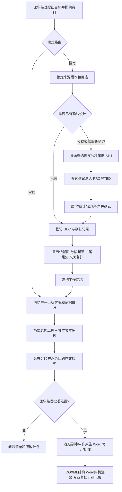

# 工具与工作原理

本文回答三个问题：这个 Skill 本质上是什么、它实际引用哪些工具、一次任务中的信息怎样流转。阅读对象是医学经理和维护人员，不要求具备编程背景。

## 1. 本质：一套受控工作流，不是单一“写作模型”

`clinical-protocol-workbench` 是 Codex 可读取的一组工作规则、参考文件、项目控制表和版本核验脚本。它本身没有单独的界面、模型、数据库或后台服务。

当医学经理提出“撰写方案”或“审核方案”时，Codex 读取入口 `SKILL.md`，选择撰写或审核模式，再按当前任务加载对应参考。只有确实需要皮肤科策略、外部证据、格式检查或 Word 交付时，才调用匹配的外部能力。

preview.5 起，两种模式每轮都必须先完整读取用户指定的 [中文初稿撰写与自检规范](REQUIRED_STANDARD.md)。原文在本机保存，完整读取不是可选的按需步骤；独立通道分别读取。文件校验、模型阅读、具体检查执行与人工复核分别留痕。

这样设计的原因是：策略判断、项目事实、写作、审核和 Word 排版是不同问题。把它们交给一个不区分来源的提示词，容易把模板参数、公开先例或模型推断误写成当前研究事实。

## 2. 总体流程



所有箭头都不是自动批准。任何会改变研究设计、安全性、统计、伦理或法规结论的节点，都需要有权角色确认。

## 3. 工具分层：哪些真的会被调用

### 3.1 随 Skill 一起安装的核心组件

| 组件 | 作用 | 会不会修改项目资料 |
| --- | --- | --- |
| `SKILL.md` | 根据用户目标选择模式，定义共同红线和工具路由 | 不直接修改文件 |
| `references/drafting-mode.md` | 规定来源角色、确认门禁、章节依赖、分段起草和交付 | 只有用户要求生成产物时才创建输出 |
| `references/review-mode.md` | 规定冻结范围、双通道、回文核实、处置和原生 Word 边界 | 默认只审核；获准后才修改新副本 |
| `references/dermatology-strategy.md` | 按给药途径、起效部位、分子类型和地区选择专业模块 | 只管理路由和交接 |
| `assets/project-control-template.md` | 保存来源、决定、证据、TBD、变更影响和版本 | 复制到项目工作区形成工作记录 |
| `assets/strategy-dependencies.lock.json` | 固定两个皮肤科策略 Skill 的提交和受控文件 SHA-256 | 只读版本清单 |
| `scripts/verify_strategy_dependencies.py` | 对实际安装的策略 Skill 逐文件核验 | 只读；不会加载或执行上游代码 |
| `examples/` | 合成边界案例，帮助维护人员检查是否会乱补参数 | 不作为临床模板或事实 |

### 3.2 条件性专业 Skill

#### `oral-derm-clinical-strategy`

用于口服系统治疗、目标为皮肤/毛发/相关皮肤感染的小分子项目。它可组织中国/FDA 路径、口服改良型新药或创新药逻辑、相对 BA/BE、食物影响、缓控释、规格桥接、DDI、特殊人群 PK、暴露-反应和 I–III 期策略。

工作包只在项目特征匹配且依赖指纹通过时读取它。它输出的是策略、候选 Synopsis、依据和风险，不会自动成为方案正文中的已确认设计。

#### `topical-clinical-strategy`

用于皮肤外用、局部起效的小分子制剂，包括乳膏、凝胶、软膏、洗剂、喷雾、泡沫和成膜制剂。它可组织创新/改良路径、最大用药试验或最大使用条件 PK（MUsT/max-use PK）、局部递送桥接、剂量探索、长期安全性和 I–III 期策略。

同样，输出先进入 `PROP-*` 或 `TBD-*`，未经确认不能成为 `DEC-*`。

这两个 Skill 不覆盖所有皮肤科产品。注射生物制剂、经皮系统递送贴剂、细胞/基因及器械主导产品应记录能力缺口，不能因适应症是皮肤病就强行使用。

### 3.3 审核 Skill：`clinical-doc-qc`

审核模式要求使用 `clinical-doc-qc`。它把审核分成两层：

1. `scripts/docqc.py` 实际读取 DOCX/PDF，检查可确定的格式和结构信息，例如字体、字号、页边距、表图编号、交叉引用、缩写等；
2. 智能体按方法论建立概念清单，核对语义矛盾、数值依赖链、条件/例外条款、跨文件一致性、覆盖性和依据性。

脚本命中只是线索，需要回到原文解释。DOCX 中缓存的目录页码不能直接判错，必须由 Microsoft Word 更新域、导出 PDF 后再核对。审核报告默认不修改方案。

标准组合安装时从固定上游取得 `clinical-doc-qc`，并以 bundle.lock.json 中的完整文件指纹检查；正文没有复制进本仓库。每个审核项目仍应记录实际使用的版本和工具运行结果。

### 3.4 可选的分阶段参考：`clinical-trial-protocol-skill`

工作包可以借鉴它“分阶段、保存中间产物、最后组装”的 waypoint 思路，帮助长文任务可恢复。但它原有流程面向更广泛的 FDA/NIH 药物或器械场景，并依赖不同的研究工具。工作包不会原样运行其完整流程，不会让它决定中文 CDE 方案的研究事实，也不要求医学经理额外安装它才能起草。

换句话说：这里引用的是一种工程组织方法，不是把第二套方案生成器叠加在正文上。

### 3.5 外部证据工具

工作包没有写死某一个数据库客户端，而是根据问题选择当前环境中可用的医学研究工具，并记录实际使用的工具和查询日期。常见类别包括：

| 证据问题 | 可选工具/来源示例 | 使用原则 |
| --- | --- | --- |
| 现行法规与技术指导原则 | 官方网站检索；CDE/NMPA、FDA、ICH | 以现行原文为准，记录版本和适用地区 |
| 同靶点/同适应症研究设计 | ClinicalTrials.gov 等注册数据库工具 | 作为先例，不自动升级为普遍要求 |
| 原始研究与综述线索 | PubMed/PMC、论文检索工具 | 摘要只是线索；关键结论回到全文 |
| 已批准产品与审评逻辑 | FDA 标签、公开审评包、官方批准信息 | 区分产品、途径、人群和地区适用性 |
| 引文整理 | 当前环境中的引用管理工具 | 保留来源定位，不让格式正确掩盖证据不足 |

标准组合固定安装 `paper-lookup`、`database-lookup` 和 `citation-management`；上游原独立 `clinicaltrials-database` 与 `pubmed-database` 已合并到相应检索入口。核心档位不安装这些工具。智能体仍需确认本次可用的网络、库和服务权限，把实际工具、查询式、日期和来源记录到项目控制表。

是否允许联网必须服从用户和组织要求。用户未授权外部检索，或无法取得全文时，智能体应标记证据缺口，继续可独立完成的结构化工作，不用模型常识补齐。

### 3.6 本地资料检索：PaperQA2（可选）

当 IB、研究报告或文献数量较多时，可以在已经验证的本地配置中用 PaperQA2 召回候选片段。它只是“帮忙找可能相关的位置”：

- 候选内容必须回到原文件及实际页/段位置核实；
- 召回不到不等于原文没有；
- 若配置要求新提供 API Key、使用共享账户或切换外部模型，停止该路径，不自动换服务；
- 工作包的基本撰写和审核不依赖 PaperQA2。

### 3.7 语言和排版线索：AutoCorrect（可选）

AutoCorrect 只适合发现中英文间距、标点等机械问题。它不能判断研究设计、医学事实、统计逻辑、法规适用性或证据真伪。任何自动修复仍须确认没有改变单位、否定、条件或专业含义。

### 3.8 文档与 Microsoft Word

文档工具用于读取或生成 DOCX/PDF；最终能力取决于用户环境。审核后如获准形成审阅副本，必须满足：

- 使用真实 `w:ins`、`w:del` 和 Word 批注；
- 保留既有修订、批注、作者、日期和关系；
- 不覆盖原件，不接受旧修订，不清除旧批注；
- 复杂结构无法可靠处理时，条目留在报告中。

交付要分四层记账：

| 层级 | 证明什么 | 不能证明什么 |
| --- | --- | --- |
| OOXML/包结构检查 | 新增修订和批注关系在受检范围内合法、旧结构被保留 | Word 一定能无修复打开、页面视觉正确 |
| Microsoft Word 实机检查 | Word 无修复打开、对象可枚举、域实际更新、含标记 PDF 可导出 | 每页无截断/错位，专业内容正确 |
| 逐页视觉检查 | 实际查看每页的分页、表格、修订、批注、目录和页眉页脚 | 医学、统计或法规内容正确 |
| 专业内容复核 | 相应角色已处置内容问题和未关闭项 | 自动等于伦理/监管批准或可递交 |

没有 Word 时只能交付审核报告和修改计划，不能用红色文字、删除线或干净重写稿冒充原生修订。

### 3.9 仓库中的实验 worker

仓库根目录的 `worker/` 和 `scripts/` 用于维护人员复现合成 DOCX 试验。它们不随 Skill 路径安装，也没有将任意模型输出直接应用到真实方案的生产入口。

实验 worker 仅支持普通正文或简单表格中单一纯文本 run 的狭窄精确变更；对字段、链接、书签、旧修订内部、现代评论、移动/属性修订和复杂结构采取拒绝处理。`user_confirmed=true` 字段本身不证明真人授权。

因此，不能把仓库中“有原生修订代码”理解为医学经理上传任意方案后一定能自动完成全部 Word 修订。

## 4. 六类记录如何防止事实混用

项目控制表不是附属表格，而是工作包的事实控制中心：

| 编号 | 含义 | 能否进入正文 |
| --- | --- | --- |
| `SRC-*` | 输入来源及其版本、哈希、角色和允许用途 | 视角色而定 |
| `PROP-*` | 策略模块或团队提出的候选建议 | 不能直接进入 |
| `DEC-*` | 内容和适用条件明确、已有真实确认记录的当前设计决定 | 可以 |
| `EVD-*` | 支持/质疑某主张的外部证据或证据缺口 | 作为依据，不替代项目决定 |
| `TBD-*` | 缺少资料、设计决定或专业复核的问题 | 只能以明确占位保留 |
| `HIST-*` | 已否决或已废弃的路径 | 禁止作为当前事实复用 |

例如，公开研究采用“每日一次”只能登记为先例或候选建议；只有本项目有权角色确认了精确频次及适用条件，它才能成为 `DEC-*` 并进入摘要、给药章节、访视表和统计相关位置。

## 5. 撰写模式的内部工作原理

1. **锁定来源**：读取所有提供文件，计算版本/哈希，登记每份资料能支持什么、不能支持什么。
2. **识别设计状态**：已确认设计直接进入 `DEC`；候选内容进入 `PROP`；未知内容进入 `TBD`；冲突并列展示。
3. **按需接入策略**：只有在设计未定或需要重新论证时才调用匹配的口服/外用策略 Skill；已有确认的 Synopsis 不强制重做策略。
4. **建立章节依赖图**：把摘要、正文、访视表、给药、PK/PD、统计和附录中重复出现的决定连接起来。
5. **分段起草**：每段只读取被允许的来源、同一版本控制表和已冻结的相邻内容，减少跨章节漂移。
6. **主笔组装**：统一术语、缩写、引用、表格和版本；逐条检查数字和决定的影响范围。
7. **冻结交付**：输出新文件、控制表、TBD/冲突清单及验证限制。后续变更先生成影响计划，不能只改当前看到的一处。

医学经理的逐阶段操作见[撰写模式详细教程](DRAFTING_TUTORIAL.md)。

## 6. 审核模式的内部工作原理

1. 指定一个唯一目标方案，证据文件不能成为修订对象；
2. 实际运行可确定的格式/结构检查；
3. 两个互不共享历史的新任务使用同一冻结输入各自做完整审核；
4. 合并结果后逐条回到原文、证据或算式核实，保留两路分歧；
5. 医学经理逐条选择不采纳、仅报告、批注、文字修改计划或待专业确认；
6. 只有获准计划才能写入新副本，并分别完成结构、Word 实机、视觉和专业层验证。

具体提示词与审核表见[审核模式详细教程](REVIEW_TUTORIAL.md)。

## 7. 专业策略 Skill 如何安装和核验

推荐优先采用 [标准组合安装](INSTALLATION.md)，可一次取得两项策略和审核/检索依赖并回读完整指纹。以下为单独管理策略依赖时的参考，不能代替标准组合安装。

把下面提示直接交给 Codex；如已有同名目录，先核验，不静默覆盖：

```text
请使用 $skill-installer，按固定版本安装缺失的专业依赖：根目录型口服 Skill 使用完整 download 方式，外用子目录可用 git 方式。
1. https://github.com/huanglu1987/oral-derm-clinical-strategy/tree/b927d7d98283d489ab2661cd9551d0d4068cda37
   安装名称：oral-derm-clinical-strategy
2. https://github.com/huanglu1987/Topical-Clinical-Strategy-Skill/tree/7edded14ad8bbb32a17e8ce2590efa735ff73c8c/topical-clinical-strategy
   安装名称：topical-clinical-strategy
不要覆盖已有目录。安装后用 clinical-protocol-workbench 自带脚本核验所选模块。
```

默认目录下的示意命令：

```sh
codex_skills_root="${CODEX_HOME:-$HOME/.codex}/skills"
python3 "$codex_skills_root/clinical-protocol-workbench/scripts/verify_strategy_dependencies.py" \
  --module oral-derm-clinical-strategy \
  --root "$codex_skills_root/oral-derm-clinical-strategy"
python3 "$codex_skills_root/clinical-protocol-workbench/scripts/verify_strategy_dependencies.py" \
  --module topical-clinical-strategy \
  --root "$codex_skills_root/topical-clinical-strategy"
```

`matched` 只表示文件与本版锁定指纹一致。`missing` 或 `mismatch` 时停用对应专业路径；不要为了让结果变绿而重算锁文件。该检查不会验证临床正确性、法规时效、人工确认身份或运行时每一次文件读取。

标准组合已包括 [clinical-doc-qc](https://github.com/huanglu1987/clinical-doc-qc) 并锁定文件树；核心档位需另行补装。项目记录应保留实际安装版本、运行命令和输出。

## 8. 数据与权限边界

- 原件默认只读，输出必须新建；工作包没有权限因为“文档需要完善”而改原件。
- 外部网页检索是网络行为；只有在用户允许且符合组织政策时进行。
- 云文档写入、发送消息、发布、改权限等外部动作必须单独获得相应授权。
- 不向用户索取聊天中的 API Key、令牌或密码；使用已有安全登录和授权流程。
- 仓库公开不代表项目资料会公开。项目资料不应提交到本仓库，真实项目目录也不应放在发行源码目录内。

## 9. 如何理解状态词

工作包刻意避免“审核通过”“CDE 合规”“可递交”等过度承诺。常用状态及含义：

- `内部工作初稿`：已按当前已确认资料生成，但仍有专业复核和/或 TBD；
- `审核中`：发现正在核实，不能当成最终问题；
- `部分审核，存在覆盖缺口`：某些文件、工具或独立通道未完成；
- `审核发现已回文核实`：问题位置和对照已复现，不代表已批准修改；
- `Word 结构检查通过`：只说明受检 OOXML 层；
- `Word 视觉检查通过`：仅在 Microsoft Word 实际渲染并逐页检查后使用；
- `待专业复核`：仍需对应有权角色确认。
